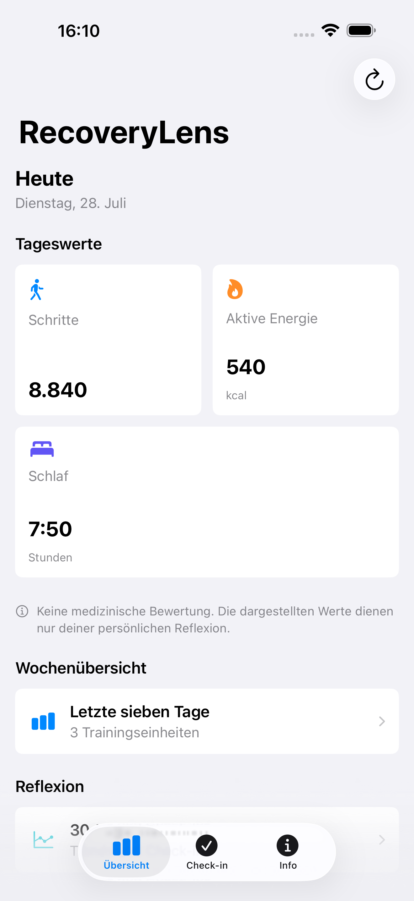
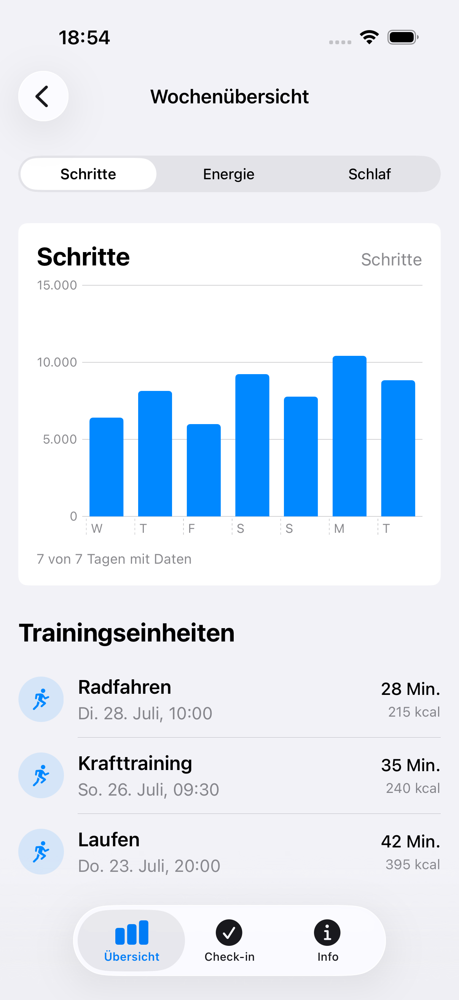
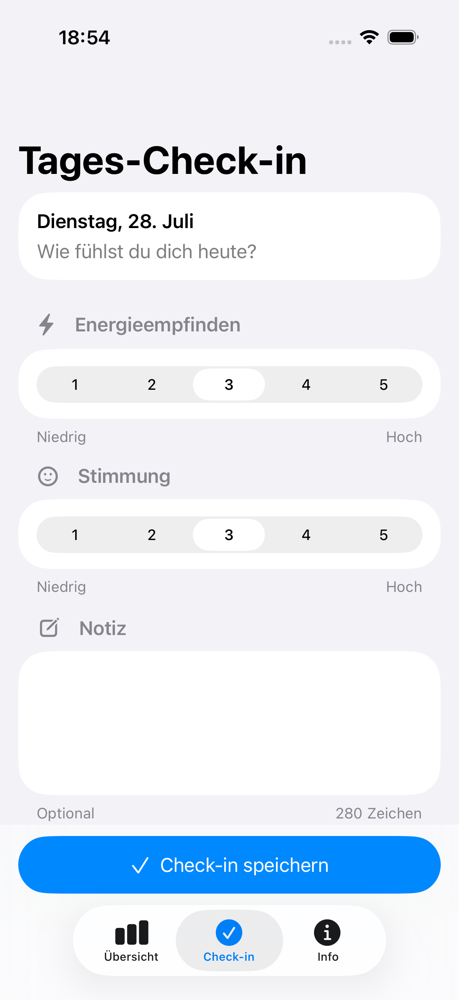

# RecoveryLens

RecoveryLens ist ein bewusst begrenztes SwiftUI-Portfolio-Projekt, das
ausgewählte Apple-Health-Daten der letzten sieben Tage übersichtlich
aufbereitet. Die App unterstützt persönliche Reflexion, erstellt aber keine
Diagnosen, Risikoeinschätzungen oder konkreten Gesundheitsempfehlungen.

## Einblick

| Dashboard | Wochenübersicht | Tages-Check-in |
| --- | --- | --- |
|  |  |  |

Alle Aufnahmen verwenden reproduzierbare, synthetische Demo-Daten. Es werden
keine persönlichen HealthKit-Daten im Repository gespeichert.

## MVP 0.1

- verständlicher, freiwilliger HealthKit-Berechtigungsfluss
- heutige Schritte, aktive Energie und Schlafdauer
- sieben Kalendertage mit Swift Charts und Trainingseinheiten
- fehlende Daten als eigener Zustand statt als gemessene Null
- lokaler Tages-Check-in mit SwiftData
- Lade-, Empty-, Partial-, Berechtigungs- und Fehlerzustände
- Infoansicht zu Datenschutz und fachlichen Grenzen
- deterministische Mock-Daten für Tests, Previews und Screenshots
- bewusst auf iPhone begrenztes MVP

## Architektur

Die App verwendet eine kleine MVVM-Struktur ohne Drittanbieter-Abhängigkeiten:

- **Views** rendern Zustand und leiten Aktionen an ViewModels weiter.
- **ViewModels** koordinieren Autorisierung, Laden und Präsentationszustände.
- **HealthKitClient** kapselt HealthKit hinter einem testbaren Protokoll.
- **HealthSummaryAggregator** bündelt reine Kalender- und Aggregationslogik.
- **SwiftData** persistiert ausschließlich manuell eingegebene Check-ins.
- **DemoData** und **MockHealthKitClient** liefern deterministische Szenarien.

```text
SwiftUI View -> ViewModel -> HealthKitClient -> HealthKit
                         -> CheckInService  -> SwiftData
```

HealthKit- und SwiftData-Abfragen finden nicht direkt in Views statt.

## Datenschutz

RecoveryLens fragt ausschließlich lesenden Zugriff auf Schritte, aktive
Energie, Schlafanalyse und Trainingseinheiten an. HealthKit-Daten werden für
die aktuelle Darstellung verarbeitet, nicht in SwiftData kopiert und nicht
übertragen. Lokal gespeichert werden nur manuelle Check-ins.

RecoveryLens betreibt dafür keine eigene Cloud-Synchronisierung. Abhängig von
den iOS-Einstellungen können lokale App-Daten dennoch Bestandteil eines vom
System verwalteten Gerätebackups sein.

Das MVP enthält kein Konto, keine Cloud-Synchronisierung, keine Analytik, keine
Werbung und keine Drittanbieter-SDKs. Apple teilt Apps nicht zuverlässig mit,
ob Lesezugriff verweigert wurde. Ein leeres Ergebnis wird deshalb nicht als
explizite Ablehnung interpretiert.

Die vollständige [Datenschutzerklärung](PRIVACY.md) ist öffentlich erreichbar
und in der Infoansicht der App verlinkt. Das gebündelte Privacy Manifest
deklariert entsprechend der aktuellen Implementierung kein Tracking, keine
Off-Device-Datenerhebung und keine direkt verwendeten Required-Reason-APIs.
Technische Rückfragen können über die [Supportseite](SUPPORT.md) ohne
Veröffentlichung persönlicher Gesundheitsdaten gestellt werden.

## Fachliche Grenzen

RecoveryLens bewertet Werte nicht als gut, schlecht, gesund, erholt oder
überlastet. Es gibt keinen Recovery- oder Readiness-Score, keine Diagnose,
keine Risikoeinschätzung und keine konkrete Schlaf-, Trainings- oder
Gesundheitsempfehlung. Der betrachtete Zeitraum endet nach sieben
Kalendertagen einschließlich heute.

Für die Schlafdauer zählen ausschließlich die von HealthKit als Schlaf
klassifizierten Zustände. Bett- und Wachzeiten werden nicht als Schlaf
gerechnet. Der lokale Schlaftag reicht von 12 Uhr des Vortags bis 12 Uhr des
angezeigten Tages, damit eine zusammenhängende Nacht nicht an Mitternacht
geteilt wird. Überlappende Intervalle mehrerer Quellen werden zeitlich
zusammengeführt, ohne einzelne Apps oder Geräte als vermeintlich bessere
Quelle einzustufen.

Weitere Entscheidungen und Trade-offs stehen in der
[Case Study](docs/CASE_STUDY.md).

## Voraussetzungen

- Xcode 26.5 oder kompatible neuere Version
- iOS 26.5 Deployment Target
- iPhone als unterstützte Gerätefamilie; iPad ist im MVP nicht vorgesehen
- Apple-Developer-Team für einen Lauf auf einem realen iPhone
- HealthKit-Capability und bestehender Purpose String im App-Target

HealthKit ist im Simulator nicht repräsentativ testbar. Für UI-Entwicklung,
Tests und Screenshots stehen deshalb DEBUG-Szenarien mit synthetischen Daten
zur Verfügung. Die echte HealthKit-Integration muss zusätzlich auf einem
physischen iPhone mit geeigneten Testdaten geprüft werden.

## Build und Tests

```bash
DEVELOPER_DIR=/Applications/Xcode.app/Contents/Developer \
xcodebuild build \
  -project RecoveryLens/RecoveryLens.xcodeproj \
  -scheme RecoveryLens \
  -destination 'generic/platform=iOS Simulator'
```

```bash
DEVELOPER_DIR=/Applications/Xcode.app/Contents/Developer \
xcodebuild test \
  -project RecoveryLens/RecoveryLens.xcodeproj \
  -scheme RecoveryLens \
  -destination 'platform=iOS Simulator,name=iPhone 17,OS=26.5'
```

Die Unit-Tests prüfen Aggregation, fehlende Daten, ViewModel-Zustände sowie
Check-in-Validierung und -Speicherung. UI-Tests decken die zentralen
Berechtigungs-, Inhalts-, Empty-, Partial- und Fehlerzustände ab. HealthKit
selbst wird nicht nachgebaut; getestet wird die eigene Logik rund um den
Client.

## Demo und Screenshots

Für einen manuellen Demo-Start kann in Xcode das Launch Argument `-demoData`
gesetzt werden. Weitere DEBUG-Szenarien sind unter anderem `-emptyData`,
`-partialData`, `-queryError`, `-authorizationRequired` und
`-healthKitUnavailable`.

Die drei README-Screenshots werden mit einem fokussierten UI-Test erzeugt:

```bash
./scripts/capture_portfolio_screenshots.sh
```

Ein anderes vorhandenes Simulatorziel kann explizit gesetzt werden:

```bash
RECOVERYLENS_DESTINATION='platform=iOS Simulator,name=iPhone 17 Pro Max,OS=26.5' \
./scripts/capture_portfolio_screenshots.sh
```

Die Standardausgabe verwendet das von App Store Connect akzeptierte
6,9-Zoll-iPhone-Format. Es werden ausschließlich synthetische Daten erfasst.

## Projektstatus

MVP `0.1.0 (1)` ist funktional umgesetzt und auf Simulatorbasis automatisiert
geprüft. Ein unsigniertes Release-Archive baut lokal erfolgreich. Die
abschließende Verifikation des Live-HealthKit-Flows auf einem realen Gerät,
Signierung und Upload sind weiterhin offene Release-Schritte. Der verifizierte
Stand und die verbleibenden Gates stehen in der
[TestFlight-Checkliste](TESTFLIGHT_CHECKLIST.md).

## Apple-Dokumentation

- [Authorizing access to health data](https://developer.apple.com/documentation/healthkit/authorizing-access-to-health-data)
- [Protecting user privacy](https://developer.apple.com/documentation/healthkit/protecting-user-privacy)
- [Running queries with Swift concurrency](https://developer.apple.com/documentation/healthkit/running-queries-with-swift-concurrency)
- [Swift Charts](https://developer.apple.com/documentation/charts)
- [SwiftData](https://developer.apple.com/documentation/swiftdata)
